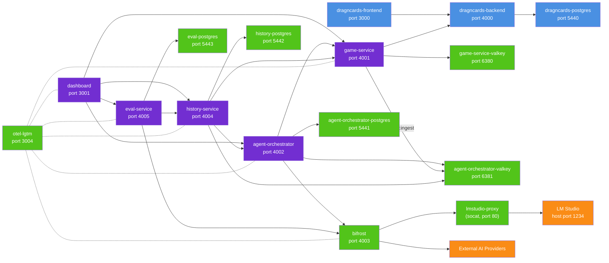

# DragncardsAI

An LLM-powered bot that plays **Marvel Champions** on [DragnCards](https://github.com/seastan/dragncards).

## Quick start

```bash
make up
# or
docker compose up -d
```

| Service            | URL                             | MCP endpoint               |
| ------------------ | ------------------------------- | -------------------------- |
| Frontend           | http://localhost:3000           | —                          |
| Backend API        | http://localhost:4000           | —                          |
| Game Service       | http://localhost:4001           | http://localhost:4001/mcp/ |
| Agent Orchestrator | http://localhost:4002           | http://localhost:4002/mcp/ |
| History Service    | http://localhost:4004           | http://localhost:4004/mcp/ |
| Eval Service       | http://localhost:4005           | http://localhost:4005/mcp/ |
| Dashboard          | http://localhost:3001           | —                          |
| Swagger playground | http://localhost:3001/swagger   | —                          |
| Bifrost AI-Gateway | http://localhost:4003           | —                          |
| Grafana            | http://localhost:3004           | —                          |
| Login              | dev_user@example.com / password | —                          |

The Swagger playground merges the OpenAPI document of **every** first-party service —
game-service, agent-orchestrator, history-service and eval-service — into one index, and
executes requests through the dashboard's `/api/proxy/<service>` routes. Which services it
covers is derived from `SERVICE_KEYS` in
`services/dashboard/features/proxy/lib/proxy.ts`, so a service appears there as soon as it is
added to that one declaration.

## Architecture



The system runs DragnCards (frontend + backend) with PostgreSQL. The game-service connects to DragnCards via HTTP/WebSocket to automate Marvel Champions gameplay. The agent-orchestrator manages AI sessions with its own PostgreSQL and Valkey, using Bifrost as an AI gateway that routes to local LM Studio (via `lmstudio-proxy`, a socat container that forwards Docker-internal traffic to the host) or external providers. It also stores **agent personas** — named, reusable bundles of a system prompt, a skill selection, and a tool configuration that a subagent can be started from. A session is created in one of two modes, chosen in the dashboard: `chat` (the default single-agent flow) or `orchestrated`, in which one agent coordinates the game and prompts one persistent agent per player seat, each with its own persona, model, and context.

The game-service and agent-orchestrator publish game/agent events onto a Valkey `history:ingest` stream. The **history-service** ingests that stream into its own PostgreSQL as an ordered, per-game event store with periodic snapshots (fetched from the game-service), and can restore a session to any past moment (seeding a resumed agent-orchestrator session). A recorded game can also be exported to, and imported from, a human-readable NDJSON bundle (see [`services/history-service/README.md`](services/history-service/README.md#history-bundles-export--import)). The **eval-service** reads recorded games from the history-service and produces hierarchical per-player move/round/game evaluations, judging via Bifrost and writing verdicts back to the history-service; it uses its own dedicated PostgreSQL. A move is judged in the context of the ROUND it belongs to, not as an isolated action, because a single play is normally several recorded actions (play the card, exhaust to pay the cost, assign the damage) and grading one of them alone marks a good play down once per action. Rounds are selected by round number from `GET /games/{game_id}/rounds` rather than by naming a move inside them, and multiple targets are graded in parallel under durable per-game and global concurrency caps. The dashboard provides a UI over all of these — live play, game history, evaluations, and persona authoring.

The Python services (agent-orchestrator, history-service, eval-service) share the internal **dragncards-common** library (schema-migration runner, RESP/Valkey client, typed Bifrost errors, an httpx base client, the OpenTelemetry bootstrap, and the MCP-surface bootstrap). All services send telemetry to otel-lgtm for observability.

## MCP surfaces

Each of the four backend services exposes its HTTP API as MCP tools over
streamable-HTTP at `/mcp`, and `.mcp.json` registers all four so an assistant
working in this repository can drive the whole system as tool calls. The
game-service surface is also what the game-playing agent itself consumes, wired
through the agent-orchestrator's session MCP registry.

Tools are **generated from each service's own OpenAPI schema** — `game-service`
does this in `services/game-service/src/game_service/mcp/server.py`, and the
other three through `dragncards_common.mcp` — so a tool is always exactly the
endpoint it came from, and a tool's name is that endpoint's `operation_id`. There
is no hand-written tool layer to drift from the API.

Each service declares the routes it keeps out of MCP, in its own `mcp_server.py`
(`mcp/server.py` for game-service): health and readiness probes, server-sent
event streams, and irreversible or deployment-global operations such as deleting
a game's recorded history or editing the shared skill/MCP/persona registries.
Exclusion applies to MCP only — every one of those endpoints still works over
HTTP.

Because those endpoints remain on HTTP, all four services also carry a strict
browser **CORS allowlist**, defaulting to the dashboard's origin
(`http://localhost:3001,http://127.0.0.1:3001`) and configurable per service via
`CORS_ALLOW_ORIGINS` (game-service, agent-orchestrator),
`HISTORY_CORS_ALLOW_ORIGINS`, and `EVAL_CORS_ALLOW_ORIGINS`. Compose publishes
4001, 4002, 4004 and 4005 on the host, so a wildcard allowlist would let any web
page a developer happens to visit reach exactly the operations withheld above —
deleting a game's recorded history, backfilling forged events, deleting agent
sessions, spending the model budget — straight from the browser. Nothing
legitimately calls these services from a browser: the dashboard fronts all four
through its own server-side proxy under `/api/proxy/<service>/`, and every other
caller is server-to-server, so none of them send an `Origin` header and none are
subject to CORS. CORS is a browser control rather than authentication — it does not
restrict `curl` or any other non-browser client, which is tracked separately.

The end-to-end debugging loop these surfaces exist for — create a game, start a
player agent, analyse its actions, read the live board, request an evaluation,
read the verdict — is documented in
[`AGENTS.md`](AGENTS.md#driving-the-system-end-to-end), including the
prerequisites (submodules, a matching build, a configured judge model) that block
it.

## Observability

Every first-party service exports traces, metrics and logs over OTLP/HTTP to the
`otel-lgtm` container; browse them in Grafana at http://localhost:3004.

The Python services get this from `dragncards_common.telemetry`: each one has a
thin `telemetry.py` that binds its own `service.name` and calls the shared
bootstrap, which sets up the tracer/meter/logger providers, the OTLP exporters,
and instrumentation for the HTTP server, outbound HTTP, SQLAlchemy and Valkey
edges. `game-service` predates the shared helper and keeps its own equivalent
copy. The `dashboard` does the equivalent in `instrumentation.ts`, and the
Bifrost gateway exports through its `otel` plugin in
`services/bifrost/config.json`.

Configuration is read from the standard OpenTelemetry environment variables, set
per service in `docker-compose.yaml` and documented in each service's
`.env.example`. Two knobs matter day to day:

```bash
# Send somewhere other than the compose collector (e.g. a direct local run)
OTEL_EXPORTER_OTLP_ENDPOINT=http://localhost:4318

# Turn telemetry off entirely; the service still starts and runs normally
OTEL_SDK_DISABLED=true
```

Spans carry identifiers, counts and outcomes only. Prompts, model responses and
recorded game state must never be attached as span attributes — the collector is
readable by anyone who can reach it. See `openspec/specs/observability/spec.md`.

## Development

```bash
# List useful commands
make

# Lint and formatting validation
scripts/lint.sh
make lint

# Apply lint and formatting fixes where supported
scripts/lint.sh --fix
make lint-fix

# Unit tests (no network required)
scripts/test.sh unit
make test-unit

# Integration tests (requires Docker stack running)
scripts/test.sh integration
make test-integration

# Rebuild images
scripts/docker.sh build
make build

# Stop and remove the stack (add down-clean to also drop volumes)
scripts/docker.sh down
make down

# Start/stop/restart infrastructure only, leaving the app services alone
scripts/docker-infrastructure.sh start   # or stop, or restart
make infra-up
make infra-down
make infra-restart
```

"Infrastructure" is every service defined in `docker-compose.infra.yaml` or
`external/docker/docker-compose.yaml`: the DragnCards frontend, backend, database and MC
plugin builder, both Valkey instances, the orchestrator/history/eval PostgreSQL databases,
Bifrost, `lmstudio-proxy`, and `otel-lgtm`. The list is derived from those two compose
files, so a newly added infra service is covered automatically. The app services —
`game-service`, `agent-orchestrator`, `history-service`, `eval-service`, `dashboard` — are
defined in `docker-compose.yaml` itself and are left untouched, so you can run them from
source with `make run` on top of Dockerised infrastructure. `infra-down` stops containers
without removing them; use `make down` to remove them.
