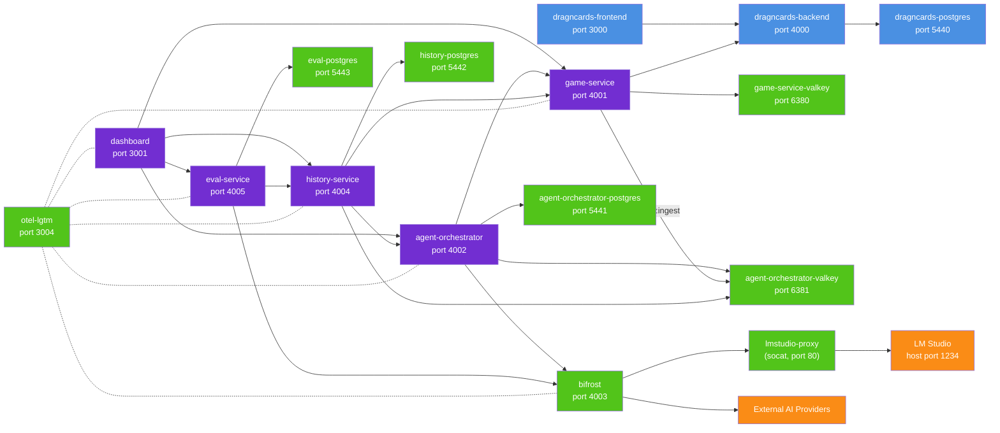

# DragncardsAI

An LLM-powered bot that plays **Marvel Champions** on [DragnCards](https://github.com/seastan/dragncards).

## Quick start

```bash
make up
# or
docker compose up -d
```

| Service            | URL                             |
| ------------------ | ------------------------------- |
| Frontend           | http://localhost:3000           |
| Backend API        | http://localhost:4000           |
| Game Service       | http://localhost:4001           |
| Agent Orchestrator | http://localhost:4002           |
| History Service    | http://localhost:4004           |
| Eval Service       | http://localhost:4005           |
| Dashboard          | http://localhost:3001           |
| Bifrost AI-Gateway | http://localhost:4003           |
| Grafana            | http://localhost:3004           |
| Login              | dev_user@example.com / password |

## Architecture



The system runs DragnCards (frontend + backend) with PostgreSQL. The game-service connects to DragnCards via HTTP/WebSocket to automate Marvel Champions gameplay. The agent-orchestrator manages AI sessions with its own PostgreSQL and Valkey, using Bifrost as an AI gateway that routes to local LM Studio (via `lmstudio-proxy`, a socat container that forwards Docker-internal traffic to the host) or external providers.

The game-service and agent-orchestrator publish game/agent events onto a Valkey `history:ingest` stream. The **history-service** ingests that stream into its own PostgreSQL as an ordered, per-game event store with periodic snapshots (fetched from the game-service), and can restore a session to any past moment (seeding a resumed agent-orchestrator session). A recorded game can also be exported to, and imported from, a human-readable NDJSON bundle (see [`services/history-service/README.md`](services/history-service/README.md#history-bundles-export--import)). The **eval-service** reads recorded games from the history-service and produces hierarchical per-player move/round/game evaluations, judging via Bifrost and writing verdicts back to the history-service; it uses its own dedicated PostgreSQL. A move is judged in the context of the ROUND it belongs to, not as an isolated action, because a single play is normally several recorded actions (play the card, exhaust to pay the cost, assign the damage) and grading one of them alone marks a good play down once per action. Rounds are selected by round number from `GET /games/{game_id}/rounds` rather than by naming a move inside them, and multiple targets are graded in parallel under durable per-game and global concurrency caps. The dashboard provides a UI over all of these — live play, game history, and evaluations.

The Python services (agent-orchestrator, history-service, eval-service) share the internal **dragncards-common** library (schema-migration runner, RESP/Valkey client, typed Bifrost errors, and an httpx base client). All services send telemetry to otel-lgtm for observability.

## Development

```bash
# List useful commands
make

# Lint and formatting validation
scripts/lint.sh
make lint

# Apply lint and formatting fixes where supported
scripts/lint.sh --fix
make lint-fix

# Unit tests (no network required)
scripts/test.sh unit
make test-unit

# Integration tests (requires Docker stack running)
scripts/test.sh integration
make test-integration

# Rebuild images
scripts/docker.sh build
make build

# Stop and remove the stack (add down-clean to also drop volumes)
scripts/docker.sh down
make down

# Start/stop/restart infrastructure only, leaving the app services alone
scripts/docker-infrastructure.sh start   # or stop, or restart
make infra-up
make infra-down
make infra-restart
```

"Infrastructure" is every service defined in `docker-compose.infra.yaml` or
`external/docker/docker-compose.yaml`: the DragnCards frontend, backend, database and MC
plugin builder, both Valkey instances, the orchestrator/history/eval PostgreSQL databases,
Bifrost, `lmstudio-proxy`, and `otel-lgtm`. The list is derived from those two compose
files, so a newly added infra service is covered automatically. The app services —
`game-service`, `agent-orchestrator`, `history-service`, `eval-service`, `dashboard` — are
defined in `docker-compose.yaml` itself and are left untouched, so you can run them from
source with `make run` on top of Dockerised infrastructure. `infra-down` stops containers
without removing them; use `make down` to remove them.
