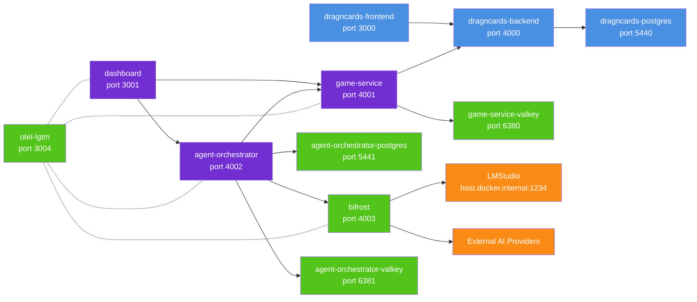

# DragncardsAI

An LLM-powered bot that plays **Marvel Champions** on [DragnCards](https://github.com/seastan/dragncards).

## Quick start

```bash
make up
# or
docker compose up -d
```

| Service            | URL                             |
| ------------------ | ------------------------------- |
| Frontend           | http://localhost:3000           |
| Backend API        | http://localhost:4000           |
| Game Service       | http://localhost:4001           |
| Agent Orchestrator | http://localhost:4002           |
| Dashboard          | http://localhost:3001           |
| Bifrost AI-Gateway | http://localhost:4003           |
| Grafana            | http://localhost:3004           |
| Login              | dev_user@example.com / password |

## Architecture



The system runs DragnCards (frontend + backend) with PostgreSQL. The game-service connects to DragnCards via HTTP/WebSocket to automate Marvel Champions gameplay. The agent-orchestrator manages AI sessions with its own PostgreSQL and Valkey, using Bifrost as an AI gateway that routes to local LMStudio or external providers. The dashboard provides a UI for interacting with both services. All services send telemetry to otel-lgtm for observability.

## Development

```bash
# List useful commands
make

# Lint and formatting validation
scripts/lint.sh
make lint

# Apply lint and formatting fixes where supported
scripts/lint.sh --fix
make lint-fix

# Unit tests (no network required)
scripts/test.sh unit
make test-unit

# Integration tests (requires Docker stack running)
scripts/test.sh integration
make test-integration

# Rebuild images
scripts/docker.sh build
make build
```
